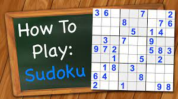

# Sudoku Solver

### Description

This repository contains code that will allow you to solve any Sudoku Puzzle!  If you aren't familiar with how Sudoku works, you can use the below link to get up to speed.

### How to Use

Now that you are familiar with Sudoku, let's look at how you can use the code in this repository.  There are three files to be familiar with:

* `sudoku.py`:
    * The main class that you can use to solve your puzzle.

* `sudoku_tests.py`:
    * Tests to ensure your class to solve Sudoku puzzles is working correctly
    * Tests to ensure your puzzle is valid

* `sudoku.ipynb`:  
    * Examples to assist with understanding the above two files
